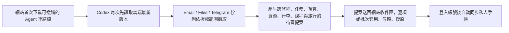

# Exchange Companion｜把這個交換手帳變成你自己的

一個可 fork／clone 的交換生網站模板，加上三個專案內建 Codex Skills。它不是只適用德國或某一間學校：先填入自己的國家、城市、學校與日期，再讓 Codex 依你授權的資料和最新官方來源，自動整理進度、期限、預算、資源、行李與旅行衝突；網站負責呈現、審核、手動調整與保存。

網站預設完全免費、local-first；純本機開發模式不需要帳號。接上自己名下的 Supabase 免費專案後，登入頁會先於私人主畫面出現，登入並載入該帳號的手帳後才能進入。唯一例外是持有旅行分享連結的訪客，只能依連結權限匿名查看或共編被分享的旅行。每個人的簽證、信件、財力、住址、課表與行政進度預設私密；只有明確選取的資源、行李、去敏航班與旅行計畫能分享。

## 三分鐘開始

```bash
git clone https://github.com/NCCUJacky80936/exchange-companion.git
cd exchange-companion
npm install
npm run setup
npm run dev
```

打開 `http://localhost:3000/`。`npm run setup` 會詢問交換國家、城市、學校、日期、時區與幣別，並寫入 `config/exchange-profile.json`。

第一次完成目的地設定後，首頁會先顯示四步「啟用交換手帳」：確認私人手帳、準備三個公開 Skills、下載私人 Codex 連結檔、送回第一批待審提案。若暫時不使用 AI，也可直接選純手動模式；日後隨時能從設定重新打開指南。完成啟用後，首頁會改為兩週行程軸、風險佈告欄、交換進度與分幣別預算控制台。

接著在 Codex 對這個 repository 說：

> 使用 $create-exchange-companion，依我的交換國家、學校與日期，把這個網站做成我的交換手帳。先告訴我要授權哪些資料，所有更新先讓我確認，再處理製圖、網站驗證與免費上雲。

## 這一包包含什麼

- React、TypeScript、Vinext／Vite 的 responsive PWA。
- 任務、個人紀錄、前置條件、依本人機票確認的行李額度、可自行新增的實體行李、資源、可由 AI 提案更新的基礎預算與 JSON 備份。
- 重要資源庫預設不沿用他人的國家資料；可貼上網址加入私人待辨識清單，再由 `$exchange-concierge` 產生可審閱資源。
- `config/packing-inspiration.json` 內含兩支交換行李經驗影片，只供 Exchange Concierge 在背景找漏項；網站不顯示影片、頻道或宣傳連結，整理結果直接成為一般行李提案。公斤數、海關與航空規定仍以本人機票與官方來源為準。
- 年度旅行規劃、Google Maps 地址／連結、課表與考試衝突檢查。
- localStorage 完整本機模式。
- 可選的 Supabase 私人同步與限旅行範圍的分享／共編。
- `config/exchange-profile.json`：可重複的國家、學校與視覺設定。
- 可選的 Telegram Concierge 自然語言提案入口：可綁定專屬 Telegram Bot，以文字即時傳送筆記／待辦／行李異動；訊息先進入私人佇列，再由排程或 Agent 比對手帳現狀並送回 Pending 提案審核。
- `$create-exchange-companion`：從選目的地、研究、製圖、網站到上雲的完整流程。
- `$exchange-concierge`：從授權信件／檔案／官方網站／Telegram 訊息抓進度；首次連結後可直接讀取雲端最新版本並送回可審核提案，JSON 保留為離線備援。
- `$exchange-email-intake`：只在目前使用者明確授權的信箱、訊息、寄件者、查詢與日期範圍內擷取證據，不綁作者帳號或德國寄件者。
- 初始化、健康檢查、設定驗證、Skill 驗證與隱私掃描。

## AI 自動整理怎麼運作



第一次連結請照順序操作：

1. 在首頁啟用指南複製公開 Skill 安裝指令，貼到自己的 Codex 任務；等 Codex 回報三個 Skills 都可使用。
2. 回網站按「下載私人連結檔」，取得 `exchange-concierge-connection.json`。不要打開、分享、貼出 token 或上傳 GitHub。
3. 按「複製第一次整理指令」，回到同一個 Codex 任務。
4. 用 Codex 的附件按鈕加入完整的 `exchange-concierge-connection.json`，再貼上指令並送出；不要把 JSON 內容貼成訊息。
5. Codex 詢問信箱、資料夾、網址、行事曆或日期時，只授權自己願意提供的精確範圍。
6. 等 Codex 回報提案已送回後，回網站按「檢查提案收件匣」。看到「待確認提案」才算連結與第一次整理成功。

正式連結檔應由 Agent 存放在 gitignored 的 `work/exchange-concierge-connection.json`。之後 Agent 會用 `baseRevision` 先讀最新手帳再送回 pending 提案，不需反覆下載／上傳 JSON。連結可隨時從網站撤銷，權限只有讀取這趟私人手帳與提交待審提案，不能自行套用。完整信件、附件與證件仍不會匯入網站。

私人連線只負責安全讀取與送達，不會自己叫醒 Agent。這個專案支援主動定時巡檢（例如每日或每週），一併檢查授權信件、本地文件變更與 **Telegram 訊息佇列**（`--include-telegram`）；若使用者在對話中直接確認新狀態，則在同一輪立即整理。所有觸發都會拉取網站最新 revision、完整驗證後只推送 pending 提案。網站在 AI 頁開啟時會每分鐘及回到分頁時自動收件。連線失效、版本衝突或驗證失敗必須主動通知，不能靜默留下只存在本機的結果。

### Telegram Concierge 自然語言入口（選配）

- 在 AI 頁面可產生一次性 10 分鐘配對碼，於專屬 Telegram Bot 輸入 `/start <配對碼>` 完成綁定。
- 支援以自然語言傳送文字筆記（如新增行李、待辦任務、行前備忘等）。
- **安全邊界**：Telegram Bot Token 與 Webhook Secret 僅由後端 Supabase Edge Function Secrets 保存；Telegram 訊息只會即時存入私人安全佇列，並在排程或 Agent 執行時轉化為 **Pending 待審提案**，任何路徑皆不會直接變更手帳內容。
- GitHub Template 只提供程式、migration 與部署說明，不含任何可直接使用的 Bot、Supabase 或網站憑證。每個新專案都必須依 `docs/CLOUD.md` 建立自己的服務並設定 secrets。

無法使用雲端時，AI 頁面仍提供完整交接 JSON 的離線下載／匯入流程。

## 常用指令

```bash
npm run setup              # 互動式建立個人交換設定
npm run doctor             # 檢查本機是否可開始
npm run dev                # 開啟本機網站
npm run check              # 上版前完整驗證
npm run privacy:check      # 確認沒有把敏感資料或個人雲端綁定放進 Git
```

## 文件

- [快速開始](docs/QUICKSTART.md)
- [從資料到網站的完整流程](docs/WORKFLOW.md)
- [Skills 使用方式](docs/SKILLS.md)
- [隱私與分享邊界](docs/PRIVACY.md)
- [免費雲端設定](docs/CLOUD.md)
- [部署流程](docs/DEPLOYMENT.md)
- [架構與可替換範圍](docs/ARCHITECTURE.md)
- [安全政策](SECURITY.md)
- [貢獻指南](CONTRIBUTING.md)

## 驗證

```bash
npm run check
```

CI 會重跑設定、Skills、隱私、lint 與 production build 測試。請另外實際檢查 `390×844`、`768×1024`、`1440×900` 三種畫面。

## License

[MIT](LICENSE)。AI 生成或自行替換的圖片也必須確認使用權，不要直接搬運素材網站的付費圖或模仿特定在世藝術家。
