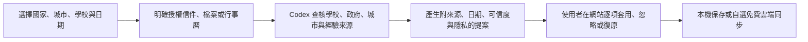

# Exchange Companion｜把這個交換手帳變成你自己的

一個可 fork／clone 的交換生網站模板，加上兩個專案內建 Codex Skills。它不是只適用德國或某一間學校：先填入自己的國家、城市、學校與日期，再讓 Codex 依你授權的資料和最新官方來源，自動整理進度、期限、資源、行李與旅行衝突；網站負責呈現、審核、手動調整與保存。

網站預設完全免費、local-first，不登入也能使用。若需要手機同步與旅行共編，可再連接自己名下的 Supabase 免費專案。每個人的簽證、信件、財力、住址、課表與行政進度預設私密；只有明確選取的資源、行李、去敏航班與旅行計畫能分享。

## 三分鐘開始

```bash
git clone https://github.com/NCCUJacky80936/exchange-companion.git
cd exchange-companion
npm install
npm run setup
npm run dev
```

打開 `http://localhost:3000/`。`npm run setup` 會詢問交換國家、城市、學校、日期、時區與幣別，並寫入 `config/exchange-profile.json`。

接著在 Codex 對這個 repository 說：

> 使用 $create-exchange-companion，依我的交換國家、學校與日期，把這個網站做成我的交換手帳。先告訴我要授權哪些資料，所有更新先讓我確認，再處理製圖、網站驗證與免費上雲。

## 這一包包含什麼

- React、TypeScript、Vinext／Vite 的 responsive PWA。
- 任務、個人紀錄、前置條件、依本人機票確認的行李額度、可自行新增的實體行李、資源、預算與 JSON 備份。
- 重要資源庫預設不沿用他人的國家資料；可貼上網址加入私人待辨識清單，再由 `$exchange-concierge` 產生可審閱資源。
- `config/packing-inspiration.json` 預載兩支交換行李 YouTube 經驗影片，僅用來發現品項；公斤數、海關與航空規定仍以本人機票與官方來源為準。
- 年度旅行規劃、Google Maps 地址／連結、課表與考試衝突檢查。
- localStorage 完整本機模式。
- 可選的 Supabase 私人同步與限旅行範圍的分享／共編。
- `config/exchange-profile.json`：可重複的國家、學校與視覺設定。
- `$create-exchange-companion`：從選目的地、研究、製圖、網站到上雲的完整流程。
- `$exchange-concierge`：從授權信件／檔案／官方網站抓進度，產生可審核的 JSON 提案。
- 初始化、健康檢查、設定驗證、Skill 驗證與隱私掃描。

## AI 自動整理怎麼運作



自動化不會靜默覆蓋手動修改。完整信件、附件與證件不會匯入網站；網站只接收提煉後的狀態與提案。

## 常用指令

```bash
npm run setup              # 互動式建立個人交換設定
npm run doctor             # 檢查本機是否可開始
npm run dev                # 開啟本機網站
npm run check              # 上版前完整驗證
npm run privacy:check      # 確認沒有把敏感資料或個人雲端綁定放進 Git
```

## 文件

- [快速開始](docs/QUICKSTART.md)
- [從資料到網站的完整流程](docs/WORKFLOW.md)
- [Skills 使用方式](docs/SKILLS.md)
- [隱私與分享邊界](docs/PRIVACY.md)
- [免費雲端設定](docs/CLOUD.md)
- [部署流程](docs/DEPLOYMENT.md)
- [架構與可替換範圍](docs/ARCHITECTURE.md)
- [安全政策](SECURITY.md)
- [貢獻指南](CONTRIBUTING.md)

## 驗證

```bash
npm run check
```

CI 會重跑設定、Skills、隱私、lint 與 production build 測試。請另外實際檢查 `390×844`、`768×1024`、`1440×900` 三種畫面。

## License

[MIT](LICENSE)。AI 生成或自行替換的圖片也必須確認使用權，不要直接搬運素材網站的付費圖或模仿特定在世藝術家。
